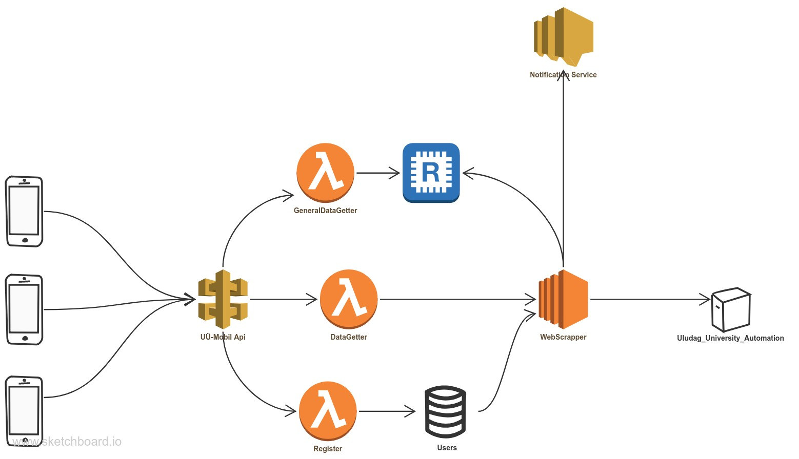
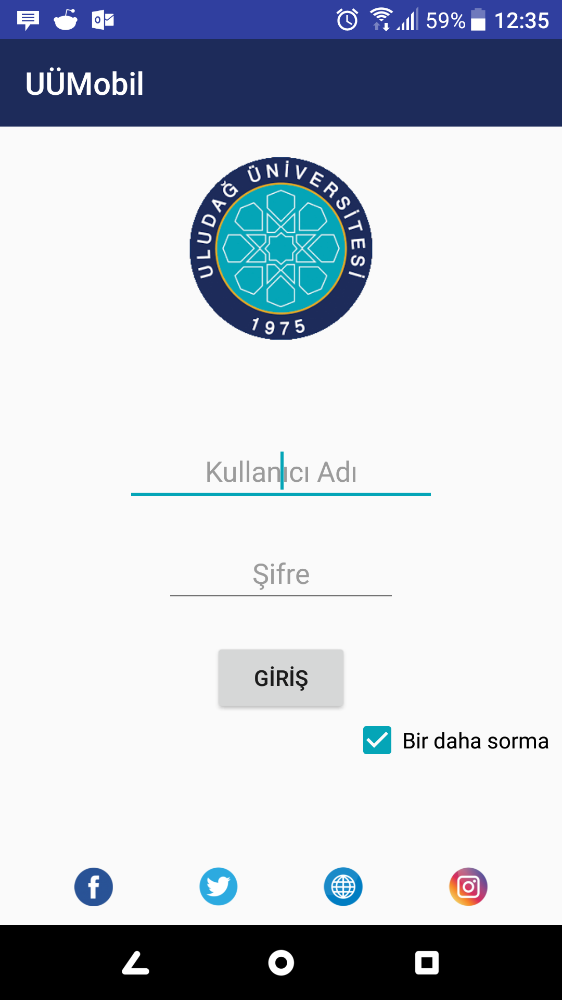
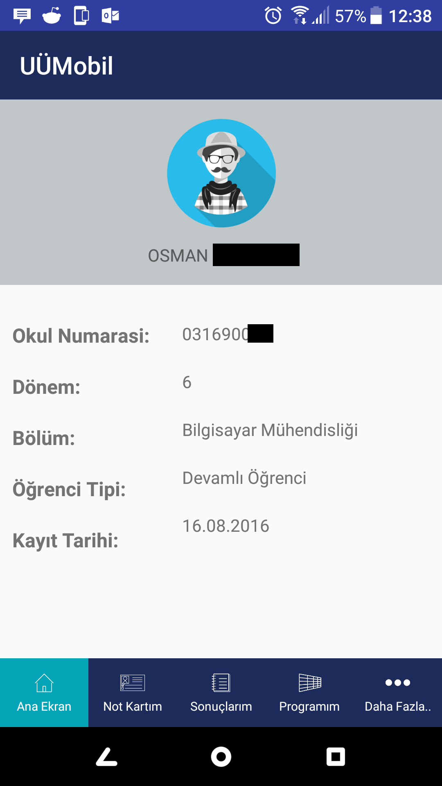
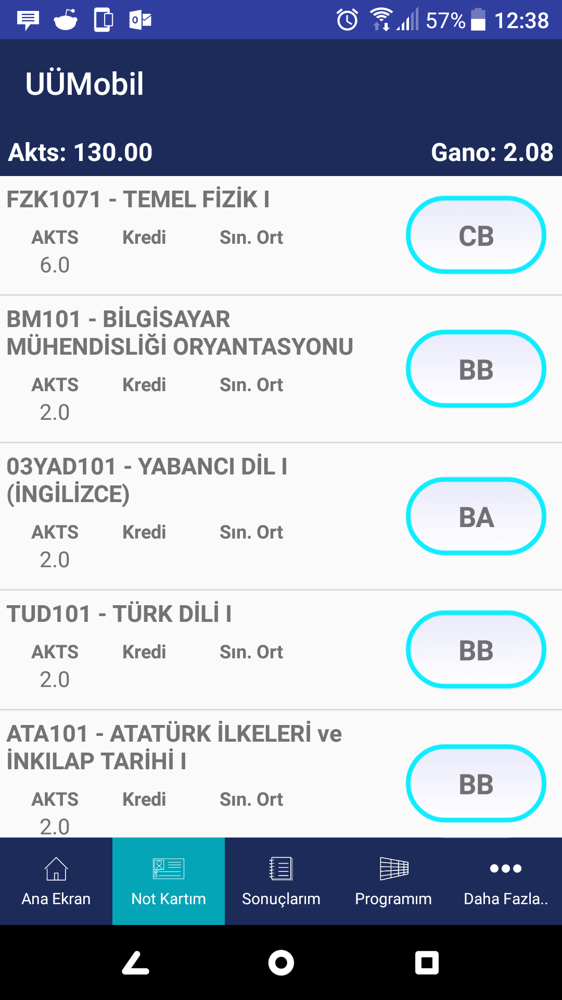
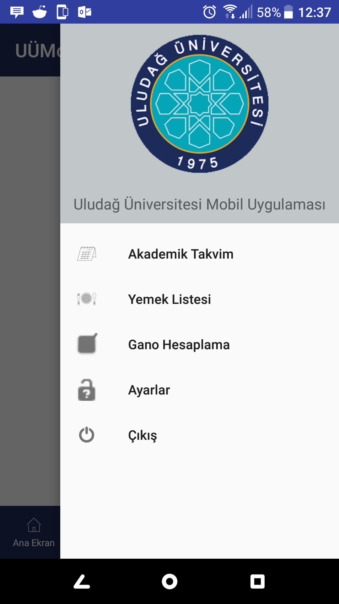
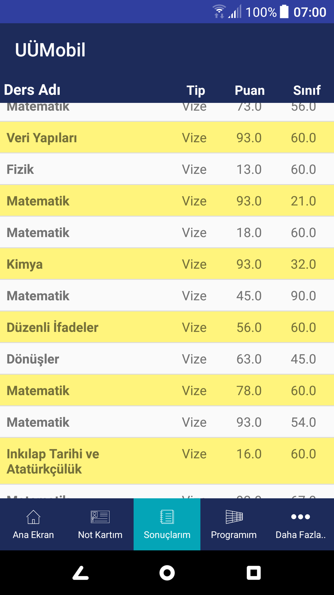
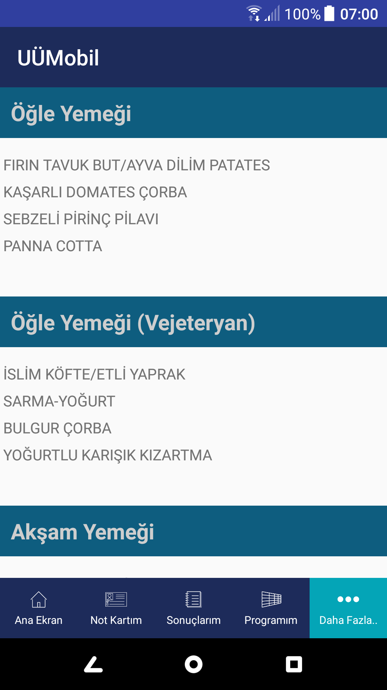
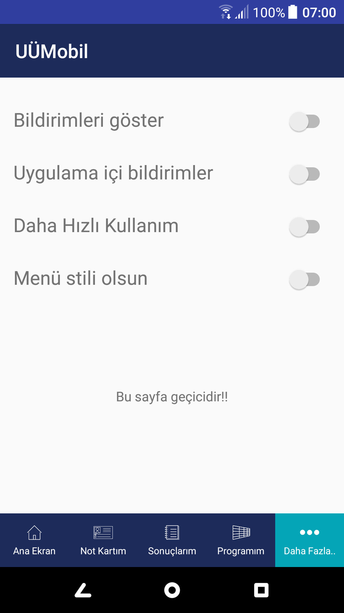

# UÜ Mobil
A mobile client for Uludag University automation system that you can your courses, notes etc.

## Method
It scraps your notes, personal infos and courses from web form of UÜ automation system when you enter your password on login screen.

This app runs only on Android devices. It visits the UÜ automation web site with your school number and password which you gave to app before and downloads pages, scraps the infos that you want. So none of your personal data stored on any server.

## Future Plan
Actually  this is my first Android project and also i have not done anything for 2 years about this project. Maybe i should :).  Also i need your help bcoz this is an open source project in the event. 

Here are some plans that i don't know when i implemet :

1. Ask to school management that i can use an api or something like this. (probably i cannot)
2. Fix the bugs 
3. Share the app on Google Play store. (if i do that i should code the IOS version also)
4. Build a cloud infrastructure for managing **notifications**, caching infos and less internet badwith. This is my infrastructure plan:

	

## Some Screenshots

	
	
	
	
	
	
	
	

